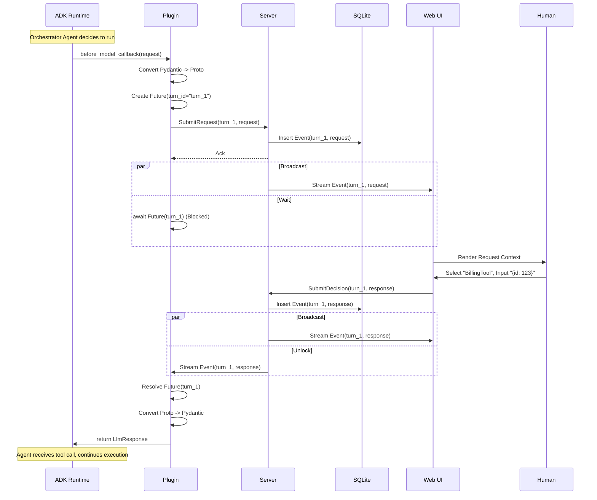

# Technical Design Document: ADK Agent Simulator (v2)

**Version:** 1.0
**Date:** January 2, 2026
**Status:** Approved
**PRD Reference:** `adk-agent-sim` PRD v2.3

## 1. System Architecture

The ADK Agent Simulator uses a **"Remote Brain"** architecture. It decouples the execution environment (the running ADK application) from the decision-making entity (the LLM/Human).

### 1.1 High-Level Diagram

```mermaid
graph TD
    subgraph "Developer Machine (Host)"
        A[ADK Application] -- "Intercepts LLM Call" --> B[SimulatorPlugin]
        
        subgraph "Simulator Environment (Docker Compose)"
            C[Envoy Proxy]
            D[Simulator Server (Python)]
            E[SQLite DB]
            F[Angular Web UI]
        end
        
        B -- "gRPC (HTTP/2)" --> D
        F -- "gRPC-Web (HTTP/1.1)" --> C
        C -- "gRPC" --> D
        D -- "Persist/Load" --> E
    end
```

### 1.2 Key Components

1.  **ADK Plugin (Client):** A Python library installed in the user's agent application. It hooks into the ADK lifecycle, serializes requests, and pauses execution while waiting for human input.
2.  **Simulator Server (Backend):** A Python gRPC server. It manages session state, persists events to SQLite, and broadcasts events between the Plugin and Web UI.
3.  **Web UI (Frontend):** An Angular application. It renders the "DevTools-style" context view and provides the control panel for human interaction.
4.  **Envoy Proxy:** Translates browser `gRPC-Web` requests to standard `HTTP/2` gRPC for the backend.

---

## 2. Data Contract (Protocol Buffers)

We leverage the official Google Generative AI protos to ensure compatibility with ADK internals, wrapped in a Simulator-specific envelope.

**Dependencies:**
*   `google.ai.generativelanguage.v1beta` (for `GenerateContentRequest` / `GenerateContentResponse`)

### 2.1 Service Definition (`simulator.proto`)

```protobuf
syntax = "proto3";
package adk.simulator.v1;

import "google/ai/generativelanguage/v1beta/generative_service.proto";
import "google/protobuf/timestamp.proto";

service SimulatorService {
  // Plugin: Registers a new session (or ensures existence)
  rpc CreateSession (CreateSessionRequest) returns (CreateSessionResponse);

  // Plugin/UI: Subscribes to the event stream.
  // Server MUST replay all historical events for the session before streaming live ones.
  rpc Subscribe (SubscribeRequest) returns (stream SessionEvent);

  // Plugin: Publishes an intercepted LLM Request
  rpc SubmitRequest (SubmitRequestPayload) returns (SubmitRequestResponse);

  // UI: Publishes a Human Decision (Response)
  rpc SubmitDecision (SubmitDecisionPayload) returns (SubmitDecisionResponse);
  
  // UI: Lists all historical sessions
  rpc ListSessions (ListSessionsRequest) returns (ListSessionsResponse);
}

// --- Messages ---

message Session {
  string id = 1;
  int64 created_at = 2; // Unix timestamp
  string description = 3; // Optional metadata
}

message CreateSessionRequest {
  string description = 1; 
}

message CreateSessionResponse {
  Session session = 1;
}

message SubscribeRequest {
  string session_id = 1;
  string client_id = 2; // UUID for debug logs
}

// The Core Envelope
message SessionEvent {
  string event_id = 1;
  string session_id = 2;
  google.protobuf.Timestamp timestamp = 3;
  
  // Correlation ID linking a Request to a Decision
  string turn_id = 4;

  // Metadata extracted for UI header/filtering
  string agent_name = 5;

  oneof payload {
    // Sent by Plugin, Received by UI
    google.ai.generativelanguage.v1beta.GenerateContentRequest llm_request = 10;
    
    // Sent by UI, Received by Plugin
    google.ai.generativelanguage.v1beta.GenerateContentResponse llm_response = 11;
  }
}

message SubmitRequestPayload {
  string session_id = 1;
  string turn_id = 2;
  string agent_name = 3;
  google.ai.generativelanguage.v1beta.GenerateContentRequest request = 4;
}

message SubmitRequestResponse {
  string event_id = 1;
}

message SubmitDecisionPayload {
  string session_id = 1;
  string turn_id = 2;
  google.ai.generativelanguage.v1beta.GenerateContentResponse response = 3;
}

message SubmitDecisionResponse {
  string event_id = 1;
}

message ListSessionsRequest {
  int32 page_size = 1;
  string page_token = 2;
}

message ListSessionsResponse {
  repeated Session sessions = 1;
  string next_page_token = 2;
}
```

---

## 3. Component Design

### 3.1 Simulator Server (Python)

**Responsibilities:**
1.  **Persistence:** Write-ahead logging of all `SessionEvent` objects to SQLite.
2.  **Broadcasting:** Managing active gRPC streams.
3.  **Replay:** Upon `Subscribe`, reading from SQLite and pushing all historical events to the stream before switching to "live" mode.
4.  **Serialization:** Using `asyncio.Lock` per session ID to ensure that if multiple parallel agents send requests, they are written and broadcast strictly sequentially (FIFO) to the UI (FR-03).

**Database Schema (SQLite):**
*   `sessions`: `id (TEXT PK)`, `created_at (INT)`, `description (TEXT)`
*   `events`: `id (TEXT PK)`, `session_id (TEXT FK)`, `turn_id (TEXT)`, `timestamp (INT)`, `proto_blob (BLOB)`

### 3.2 ADK Plugin (Python Client)

**Hook Point:** `before_model_callback`

**Logic Flow (The "Future Map" Pattern):**
The plugin maintains a singleton `SimulatorClient`.

1.  **Init:**
    *   Connects to gRPC server (config from Env/Constructor).
    *   Calls `CreateSession`. Prints URL to `stdout`.
    *   Starts a background task: `_listen_loop()`.

2.  **The Background Loop (`_listen_loop`):**
    *   Calls `Subscribe(session_id)`.
    *   Iterates over incoming `SessionEvent`.
    *   If event is `llm_response`:
        *   Looks up `turn_id` in `self._pending_futures`.
        *   If found, calls `future.set_result(event.llm_response)`.

3.  **The Interception (`before_model_callback`):**
    *   **Convert:** Uses ADK internal mapper (e.g., `google.genai.types.GenerateContentRequest.to_proto()`) to convert the Pydantic `LlmRequest` to the Protobuf `GenerateContentRequest`.
    *   **Generate ID:** Creates a unique `turn_id`.
    *   **Register Future:** `future = loop.create_future(); self._pending_futures[turn_id] = future`.
    *   **Publish:** Calls `SubmitRequest` RPC.
    *   **Await:** `result = await future` (No timeout/Infinite wait).
    *   **Return:** Returns `result` (LlmResponse) to ADK, short-circuiting the real model call.

**Handling Reconnects (Replay Strategy):**
*   If the connection drops, `_listen_loop` attempts to reconnect.
*   On reconnect, the Server replays history.
*   The Plugin ignores events for `turn_ids` not in `_pending_futures` (historical completed turns).
*   It eventually receives the `llm_response` for the *currently blocked* `turn_id` and resolves the future.

### 3.3 Web UI (Angular)

**Tech Stack:** Angular 18+, Angular Material (Shell), Custom Components (Tree), Connect-ES (gRPC Client).

**Core Components:**

1.  **`SessionListComponent`**:
    *   Calls `ListSessions` RPC.
    *   Displays sessions table.

2.  **`SimulationComponent` (Split Layout)**:
    *   **Left Pane:** `EventStreamComponent`.
    *   **Right Pane:** `ControlPanelComponent`.
    *   **Logic:**
        *   On init, calls `Subscribe`.
        *   Maintains a local array `events`.
        *   Derived state: `pendingRequest = events.findLast(e => e.hasRequest && !hasResponse(e.turnId))`.

3.  **`EventStreamComponent`**:
    *   Renders the linear list of events.
    *   Uses `RecursiveTreeComponent` for payloads.

4.  **`RecursiveTreeComponent` (The "DevTools" View)**:
    *   **Input:** `data: any`.
    *   **Logic:**
        *   Detects types: Object, Array, Primitive.
        *   Detects "Smart Blobs": Strings starting with `{` or `[` -> JSON Mode. Strings with Markdown chars -> MD Mode.
    *   **Rendering:**
        *   Recursive `<ul><li>` structure.
        *   Thread lines via CSS borders.
        *   Syntax highlighting via CSS classes (`.key`, `.string`, `.number`).
        *   Toggles: `[RAW]`, `[JSON]`, `[MD]` pills.

5.  **`ControlPanelComponent`**:
    *   **Input:** `currentRequest` (Protobuf object).
    *   **Logic:**
        *   Extracts `tools` from `currentRequest.tools` (list of `Tool` protos).
        *   **Tool Catalog:** Renders available tools as cards/list.
        *   **Dynamic Form:** When tool selected, maps `Tool.function_declarations[0].parameters` (OpenAPI-like Schema) to Angular `FormGroup`.
        *   **Submission:** Helper to construct `GenerateContentResponse` proto with a `FunctionCall` part or `Text` part.
        *   Calls `SubmitDecision` RPC.

---

## 4. Interaction Flows

### 4.1 Orchestrator Interception Flow



---

## 5. Deployment Strategy

**`docker-compose.yaml`**:

```yaml
services:
  backend:
    build: ./backend
    command: python -m simulator.server
    volumes:
      - ./data:/app/data  # Persistence for SQLite
    ports:
      - "50051:50051"

  frontend:
    build: ./frontend
    ports:
      - "4200:80"

  envoy:
    image: envoyproxy/envoy:v1.26
    volumes:
      - ./envoy.yaml:/etc/envoy/envoy.yaml
    ports:
      - "8080:8080" # gRPC-Web port
    depends_on:
      - backend
```

## 6. Implementation Plan

1.  **Environment Setup:** Define `.devcontainer`, `buf` config, and `docker-compose`.
2.  **Backend Core:** Implement `SimulatorService` and SQLite storage.
3.  **Frontend Core:** Implement Angular shell, `Connect-ES` client, and `EventStream`.
4.  **Frontend UX:** Implement `RecursiveTree` and Smart Blob detection.
5.  **Plugin Core:** Implement `SimulatorPlugin` and the async future-map logic.
6.  **Integration:** Connect ADK sample app with Plugin to Simulator.